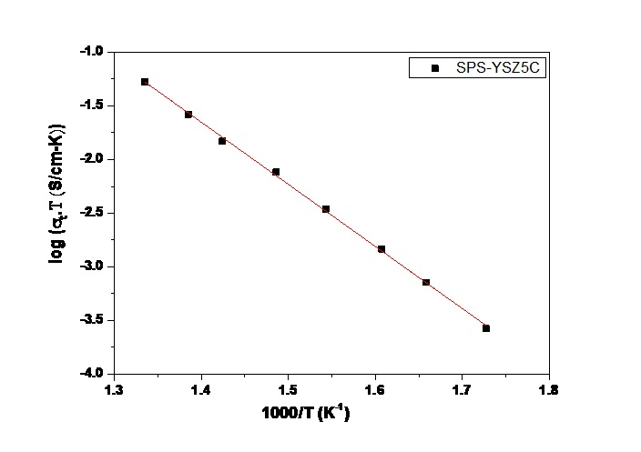

Ionic conductivity is the ability of a material to conduct electric current. The conductivity (σ), is expressed as the inverse of resistivity (ρ) i.e., σ = 1/ρ and its unit is Siemens. Specific conductivity is the reciprocal of the specific resistance of a solution measured between two electrodes 1 cm2 in area and 1 cm apart. Conductivity is measured by placing two electrodes (with opposite electrical charge) in the electrolyte. For a known electrical current, the voltage drop across the electrodes reveals the electrolyte's resistance.  

 
<video width="500" height="240" controls>
  <source src="images/impedance.mp4" type="video/mp4">
  Your browser does not support the video tag</video>
 
  

  
<b>WORKING OF SOFC</b>  
Air flows along the cathode, when an oxygen molecule contacts the cathode/electrolyte interface; it acquires four electrons from the cathode and splits into two oxygen ions.Air flows along the cathode, when an oxygen molecule contacts the cathode/electrolyte interface; it acquires four electrons from the cathode and splits into two oxygen ions. These oxygen ions diffuse into the electrolyte material and migrate to the other side of the cell where they encounter the anode/electrolyte interface. Here they react, giving off water, carbon dioxide and heat. The electrons go through the anode to the external circuit and return to the cathode , thereby producing electrical electrochemical device that converts the chemical energy in oxygen and hydrogen to react.Here they react, giving off water, carbon dioxide and heat. The electrons go through the anode to the external circuit and return to the cathode , thereby producing electrical electrochemical device that converts the chemical energy in oxygen and hydrogen to react.  
<b>Crystal structure of 8 mol %Yttria stabilized Zirconia (electrolyte material)</b>  
  
<b>Fuel Cell Test Station Setup</b>  
  
<b>Schematic of sample holder used for ionic conductivity measurements</b>  
  
<b>Results</b>  
Following Ionic conductivity YSZ electrolyte material for solid oxide fuel cell applications.  
Arrhenius plots for the 8YSZ sample 
  
Arrhenius plots for the 5 wt.% CeO2 doped 8YSZ sample 
 
The high ionic conductivity of 5 wt.% CeO2 doped 8 YSZ can be attributed to the reduction in average binding energy of 8YSZ by adding CeO2 of lower lattice binding energy.  
<b>Comparison between two samples</b>  
This plot represents comparison between the pure Yttria stabilized Zirconia and 5 wt.% Ceria doped Yttria stabilised Zirconia, which shows that 5% Ceria doped material shows high ionic conductivity  
 

